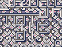

# Autotiler

Generates an autotiler texture from a given texture. The input needs to be a tileable texture with 6 x 8 (width x height) tiles. Look at the Input image for inspiration in how to construct the input for the Autotiler.

## Input

## Output

You can then use the generated output and tile a map using the helper function `get_tile_position`. Check the random example for how to use this library.

